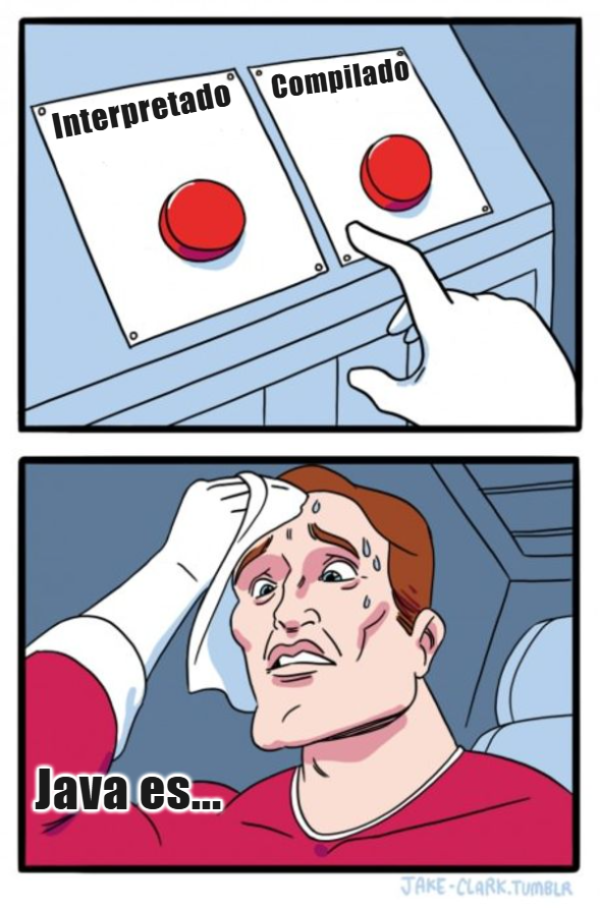
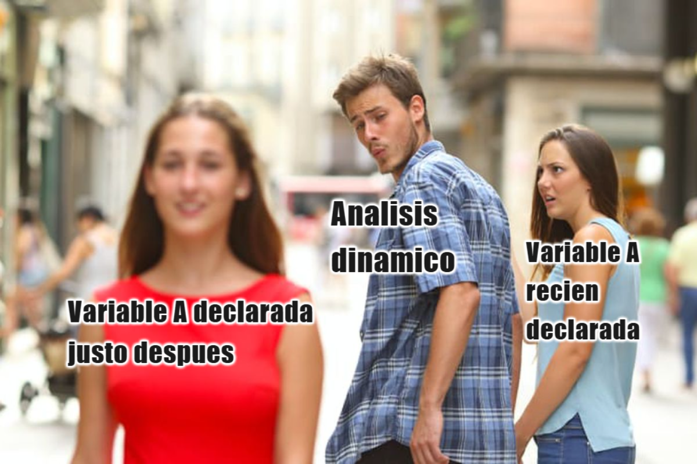
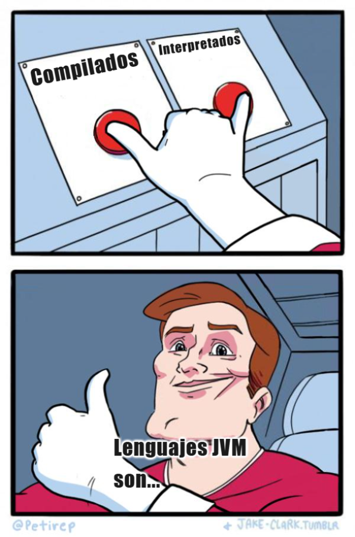

# Parcial 4 - Lenguajes de programación 1 (CI3641)

**Hecho por:** *Juan Cuevas* (19-10056)

## Pregunta 1

Escoja algún lenguaje de programación de alto nivel, de propósito general y orientado a objetos que no comience con alguna de sus iniciales (ya sea de alguno de sus nombres o alguno de sus apellidos).

1. De una breve descripción del lenguaje escogido. 
   
   i. Explique la manera de crear y manipular objetos que tiene el lenguaje, incluyendo: constructores, métodos, campos, etc. 
   
   ii. Describa el funcionamiento del manejo de memoria, ya sea explícito (new/delete) o implícito (recolector de basura). 
   
   iii. Diga si el lenguaje usa asociación estática o dinámica de métodos y si hay forma de alterar la elección por defecto del lenguaje. 
   
   iv. Describa la jerarquía de tipos, incluyendo mecanismos de herencia múltiple (de haberlos), polimorfismo paramétrico (de tenerlo) y manejo de varianzas.

2. Implemente los siguientes programas en el lenguaje escogido: 
   
   i. Defina un interfaz o clase abstracta Secuencia, que represente una colección ordenada de elementos. Debe tener los siguientes métodos: 
    - agregar: Recibe un elemento y lo agrega a la secuencia. 
    - remover: Devuelve un elemento de la secuencia y lo elimina de la misma. Arroja un error si está vacía. 
    - vacio: Dice si la secuencia está vacía (no tiene elementos). Defina dos clases concretas Pila y Cola que sean subtipo de Secuencia 
    - Para Pila los elementos se manejan de tal forma que el último en ser agregado es el primero en ser removido. 
    - Para Cola los elementos se manejan de tal forma que el primero en ser agregado es el primero en ser removido.

   ii. Defina un tipo de datos que represente grafos como listas de adyacencias y cada nodo sea representado por un número entero (puede usar todas las librerías a su disposición en el lenguaje). Además, defina una clase abstracta Busqueda que debe tener un método buscar. Este método debe recibir dos enteros: D y H, y debe devolver la cantidad de nodos explorados, partiendo desde el nodo D hasta llegar al nodo H. En caso de que H no sea alcanzable desde D, debe devolver el valor-1 (menos uno). Esta clase debe estar parcialmente implementada, dejando solamente abstraído el orden en el que se han de explorar los nodos. Defina dos clases concretas DFS y BFS que sean subtipo de Busqueda. 
    - Para DFS el orden de selección de nodos es a profundidad (usando un pila). 
    - Para BFS el orden de selección de nodos es a amplitud (usando un cola).

### Solución

Lenguaje escogido: **Python**

#### Descripción del lenguaje

**i.** La forma de crear y manipular objetos en Python es bastante sencilla. Para crear un objeto, simplemente se define una clase y se instancia. Las clases en Python son definidas con la palabra clave `class` seguida del nombre de la clase y dos puntos. Dentro de la clase se definen los métodos y atributos de la clase. Para crear un objeto de una clase, se llama al constructor de la clase, que es el método `__init__` de la clase. Para acceder a los atributos y métodos de un objeto, se utiliza la notación de punto. Por ejemplo, si se tiene un objeto `obj` de la clase `Clase`, se accede al atributo `atributo` con `obj.atributo` y al método `metodo` con `obj.metodo()`. Además, Python dicha instancia se puede crear con o sin paréntesis.

```python
class Clase:
    def __init__(self, atributo):
        self.atributo = atributo

    def metodo(self):
        return self.atributo
```

Se instancia de la siguiente manera:

```python
obj = Clase("Hola")
print(obj.metodo())  # Imprime "Hola"
```

**ii.** Python utiliza un recolector de basura para manejar la memoria. El recolector de basura de Python es un algoritmo de conteo de referencias que se encarga de liberar la memoria de los objetos que ya no son referenciados. El recolector de basura de Python es automático y no necesita intervención del programador. Sin embargo, Python también permite la gestión manual de la memoria a través de las funciones `gc.collect()` y `gc.enable()`. Esto permite al programador liberar la memoria de los objetos que ya no son necesarios. Para liberar la memoria de un objeto manualmente, se puede utilizar la función `del`. Para liberar memoria con `gc.collect()`, se debe importar el módulo `gc` de la siguiente manera:

```python
import gc

# Habilitar el recolector de basura
gc.enable()

# Recolectar la basura
gc.collect()

# Liberar memoria de un objeto
obj = {
    "clave": "valor"
}
del obj

# Liberar memoria de una lista
lista = [1, 2, 3]
del lista
```

**iii.** Python utiliza asociación dinámica de métodos. Esto significa que la resolución de los métodos se realiza en tiempo de ejecución. Python permite la alteración de la elección por defecto de la asociación de métodos mediante la función `super()`. La función `super()` permite acceder a los métodos de la superclase de una clase. Esto es útil cuando se quiere llamar a un método de la superclase desde una subclase. La función `super()` se utiliza de la siguiente manera:

```python
class SuperClase:
    def metodo(self):
        print("Método de la superclase")

class SubClase(SuperClase):
    def metodo(self):
        super().metodo()
        print("Método de la subclase")

obj = SubClase()
obj.metodo()
```

**iv.** La jerarquía de tipos en Python es sencilla. Python es un lenguaje de tipado dinámico, lo que significa que las variables no tienen un tipo fijo y pueden cambiar de tipo durante la ejecución del programa. Python no soporta la herencia múltiple directamente, pero se puede simular utilizando la función `super()`. Python soporta el polimorfismo paramétrico a través de los tipos genéricos. Los tipos genéricos permiten definir clases y funciones que pueden trabajar con cualquier tipo de datos. Python soporta la covarianza y la contravarianza. La covarianza permite que un tipo sea reemplazado por un subtipo, mientras que la contravarianza permite que un tipo sea reemplazado por un supertipo. Python no soporta la invarianza, que es la restricción de que un tipo no puede ser reemplazado por otro tipo. 

#### Implementación de los programas

**i.** Definición de la interfaz `Secuencia` y las clases concretas `Pila` y `Cola`:

Para ejecutar dicho código, se debe ejecutar el siguiente comando:

```bash
./main.sh exe1-b.py
```

**ii.** Definición del tipo de datos que representa grafos como listas de adyacencias y las clases abstractas `Busqueda`, `DFS` y `BFS`:

Para ejecutar dicho código, se debe ejecutar el siguiente comando:

```bash
./main.sh exe1-c.py
```

## Pregunta 2

Tomandocomoreferencia las constantes X, Y y Z planteadas en los párrafos de introducción del examen, considere las siguientes definiciones de clases, escritas en pseudo–código:

```python
class Bebida { 
    int a = X, b = Y 
    
    fun s(int x): int { 
        a = b + x return t(a) 
    } 
    
    fun t(int y): int { 
        return b * y + a 
    } 
}
```

```python
class Cafe extends Bebida {
    Bebida caliente = new Marron() 
    
    fun t(int y): int { 
        return caliente.s(a + b) + y 
    } 
}
```

```python
class Marron extends Cafe { 
    int c = Z 

    fun s(int x): int { 
        a = c + x - 2 
        c = a + b * x 
        return t(a * b + c) 
    } 
    
    fun t(int y): int { 
        return c - y 
    } 
}
```

Considere además el siguiente fragmento de código:

```python
Bebida e = new Cafe() 
Bebida pres = new Marron() 
Cafe o = new Marron() 
print(e.s(1) + pres.s(1) + o.s(1))
```

Diga qué imprime el programa en cuestión si el lenguaje tiene:
1. Asociación estática de métodos.
2. Asociación dinámica de métodos.

Recuerde mostrar paso a paso el estado del programa (la pila de ejecución).

### Solución

X = 0, Y = 5, Z = 6

#### Asociación estática de métodos

1. Se crea un objeto `e` de la clase `Cafe` y se asigna a la variable `e`. Se define el tipo de `e` como `Bebida`.
2. Se crea un objeto `pres` de la clase `Marron` y se asigna a la variable `pres`. Se define el tipo de `pres` como `Bebida`.
3. Se crea un objeto `o` de la clase `Marron` y se asigna a la variable `o`. Se define el tipo de `o` como `Cafe`.

Indice | Clase | Variable | Valor |
-------|-------|----------|-------|
0      | Bebida| a        | 0     |
1      | Bebida| b        | 5     |
2      | Marron| c        | 6     |

1. Se llama al método `s` del objeto `e` con el argumento `1`. Se llama al método `s` de la clase `Bebida` con el argumento `1`. Se asigna `a = b + x = 5 + 1 = 6`. Se llama al método `t` de la clase `Bebida` con el argumento `6`. Se retorna `b * y + a = 5 * 6 + 6 = 36`.

2. Se llama al método `s` del objeto `pres` con el argumento `1`. Se llama al método `s` de la clase `Bebida` con el argumento `1`. Se asigna `a = b + x = 5 + 1 = 6`. Se llama al método `t` de la clase `Bebida` con el argumento `6`. Se retorna `b * y + a = 5 * 6 + 6 = 36`.

3. Se llama al método `s` del objeto `o` con el argumento `1`. Se busca el método `s` en la clase `Cafe`, como no se encuentra, se busca en la superclase `Bebida`. Se llama al método `s` de la clase `Bebida` con el argumento `1`. Se asigna `a = b + x = 5 + 1 = 6`. Se llama al método `t` de la clase `Cafe` con el argumento `6`. Retorna `caliente.s(a + b) + y`. Se llama el método `s` en la clase `Bebida` con el argumento `a + b = 6 + 5 = 11`. Se asigna `a = b + x = 5 + 11 = 16`. Se llama al método `t` de la clase `Bebida` con el argumento `16`. Retorna `b * y + a = 5 * 16 + 16 = 96`. Retorna `96 + 6 = 102`.

4. Se imprime `36 + 36 + 102 = 174`.

#### Asociación dinámica de métodos

1. Se crea un objeto `e` de la clase `Cafe` y se asigna a la variable `e`. Se define el tipo de `e` como `Bebida`.
2. Se crea un objeto `pres` de la clase `Marron` y se asigna a la variable `pres`. Se define el tipo de `pres` como `Bebida`.
3. Se crea un objeto `o` de la clase `Marron` y se asigna a la variable `o`. Se define el tipo de `o` como `Cafe`.

Indice | Clase | Variable | Valor |
-------|-------|----------|-------|
0      | Bebida| a        | 0     |
1      | Bebida| b        | 5     |
2      | Marron| c        | 6     |

1. Se llama al método `s` del objeto `e` con el argumento `1`. Se llama al método `s` de la clase `Bebida` con el argumento `1`. Se asigna `a = b + x = 5 + 1 = 6`. Se llama al método `t` de la clase `Cafe` con el argumento `6`. Se retorna `caliente.s(a + b) + y`. Se llama el método `s` en la clase `Marron` con el argumento `a + b = 6 + 5 = 11`. 
    1.1 Se asigna `a = c + x - 2 = 6 + 11 - 2 = 15`.
    1.2 Se asigna `c = a + b * x = 15 + 5 * 11 = 70`.
    1.3 Se llama al método `t` de la clase `Marron` con el argumento `a * b + c = 15 * 5 + 70 = 145`. Se retorna `c - y = 70 - 145 = -75`.
    1.4 Se retorna `-75`.
2. Se retorna `caliente.s(a + b) + y = -75 + 6 = -69`.
3. Se llama al método `s` del objeto `pres` con el argumento `1`. Se llama al método `s` de la clase `Marron` con el argumento `1`. Se asigna `a = c + x - 2 = 6 + 1 - 2 = 5`. Se asigna `c = a + b * x = 5 + 5 * 1 = 10`. Se llama al método `t` de la clase `Marron` con el argumento `a * b + c = 5 * 5 + 10 = 35`. Se retorna `c - y = 10 - 35 = -25`.
    3.1 Se asigna `a = c + x - 2 = 10 + 1 - 2 = 9`.
    3.2 Se asigna `c = a + b * x = 9 + 5 * 1 = 14`.
    3.3 Se llama al método `t` de la clase `Marron` con el argumento `a * b + c = 9 * 5 + 14 = 59`. Se retorna `c - y = 14 - 59 = -45`.
    3.4 Se retorna `-45`.
4. Se llama al método `s` del objeto `o` con el argumento `1`. Se llama al método `s` de la clase `Marron` con el argumento `1`. Se asigna `a = c + x - 2 = 6 + 1 - 2 = 5`. Se asigna `c = a + b * x = 5 + 5 * 1 = 10`. Se llama al método `t` de la clase `Marron` con el argumento `a * b + c = 5 * 5 + 10 = 35`. Se retorna `c - y = 10 - 35 = -25`.
    4.1 Se asigna `a = c + x - 2 = 10 + 1 - 2 = 9`.
    4.2 Se asigna `c = a + b * x = 9 + 5 * 1 = 14`.
    4.3 Se llama al método `t` de la clase `Marron` con el argumento `a * b + c = 9 * 5 + 14 = 59`. Se retorna `c - y = 14 - 59 = -45`.
    4.4 Se retorna `-45`.
5. Se imprime `- 75 - 45 - 45 = -165`.

## Pregunta 3

Se desea que modele e implemente, en el lenguaje de su elección, un manejador de tablas de métodos virtuales para un sistema orientado a objetos con herencia simple y despacho dinámico de métodos:

1. Debe saber tratar con definiciones de clases, potencialmente con herencia simple. Estas definiciones tendrán únicamente los nombres de los métodos que poseerá.
2. Una vez iniciado el programa, pedirá repetidamente al usuario una acción para proceder. Tal acción puede ser:
   
    i. `CLASS <tipo> [<nombre>]`
    
    Define un nuevo tipo que poseerá métodos con nombres establecidos en la lista proporcionada. El `<tipo>` puede ser:
    - Un nombre, que establece un tipo que no hereda de ningún otro.
    - Una expresión de la forma `<nombre> : <super>`, que establece el nombre del tipo y el hecho de que este tipo hereda del tipo con nombre `<super>`.
    
    Por ejemplo: CLASS A f g y CLASS B : A f h

    Notemos que es posible reemplazar definiciones de una super clase en clases que la heredan.

    El programa debe reportar un error e ignorar la acción si el nombre de la nueva clase ya existe, si la clase super no existe, si hay definiciones repetidas en la lista de nombres de métodos o si se genera un ciclo en la jerarquía de herencia.

    ii. `DESCRIBIR <nombre>`
    
    Debe mostrar la tabla de métodos virtuales para el tipo con el nombre propuesto.

    Por ejemplo: `DESCRIBIR B` 
    
    Esto debe mostrar: 
    
    f-> B :: f 
    
    g-> A :: g 
    
    h-> B :: h 
    
    El programa debe reportar un error e ignorar la acción si el nombre del tipo no existe.

    iii. `SALIR`

    Debe salir del simulador.

Al finalizar la ejecución de cada acción, el programa deberá pedir la siguiente acción al usuario.

Investigue herramientas para pruebas unitarias y cobertura en su lenguaje escogido y agregue pruebas a su programa que permitan corroborar su correcto funcionamiento. Como regla general, su programa debería tener una cobertura (de líneas de código y de bifuración) mayor al 80%.

### Solución

Para ejecutar dicho código, se debe ejecutar el siguiente comando:

```bash
./main.sh exe3
```

Para realizar las pruebas unitarias y analizar la cobertura de las mismas, se debe ejecutar el siguiente comando:

```bash
./main.sh exe3-test
```

## Pregunta 4

Considere las funciones foldr y const, escritas en un lenguaje muy similar a Haskell:

```haskell
foldr :: (a-> b-> b)-> b-> [a]-> b 
foldr _ e [] = e 
foldr f e (x:xs) = f x $ foldr f e xs 

const :: a-> b-> a 
const x _ = x
```

Considere también la siguiente función que aplica una función solamente sobre la cola de una lista y agrupa la cabeza con otro valor dado:

```haskell
what :: a-> ([b]-> [(a, b)])-> [b]-> [(a, b)] 
what _ _ [] = [] 
what x f (y:ys) = (x, y) : f ys
```

1. Considere la siguiente implementación de una función misteriosa, usando foldr:
   
    ```haskell
    misteriosa :: ??? 
    misteriosa = foldr what (const [])
    ```

    Considere también la siguiente función, que genera una lista de números enteros a partir de un cierto valor inicial:

    ```haskell
    gen :: Int-> [Int] 
    gen n = n : gen (n + 1)
    ```

    Muestre la evaluación, paso a paso, de la expresión misteriosa "abc" (gen 1), considerando que:

    - El lenguaje tiene orden de evaluación normal.
    - El lenguaje tiene evaluación aplicativo.
    
    _Si sospecha que en algún momento uno de estos programas puede caer en una evaluación recursiva infinita, realice las primeras expansiones, detenga la evaluación y argumente las razones por las que cree que dicha evaluación no terminaría._

2. Considere el siguiente tipo de datos que representa árboles binarios con información en las ramas:

    ```haskell
    data Arbol a = Hoja | Rama a (Arbol a) (Arbol a)
    ```

    Construya una función `foldA` (junto con su firma) que permita reducir un valor de tipo (Arbol a) a algún tipo b (de forma análoga a `foldr`). Su implementación debe poder tratar con estructuras potencialmente infinitas.

    Su función debe cumplir con la siguiente firma:

    ```haskell
    foldA :: (a-> b-> b-> b)-> b-> Arbol a-> b
    ```

3. Considere una versión de la función what que funciona sobre árboles (aplica la función proporcionada a ambos sub–árboles) y llamésmola what tree function:

    ```haskell
    whatTF :: a
        -> (Arbol b-> Arbol (a, b))
        -> (Arbol b-> Arbol (a, b))
        -> Arbol b
        -> Arbol (a, b) 
    whatTF _ _ _ Hoja = Hoja 
    whatTF x f g (Rama y i d) = Rama (x, y) (f i) (g d)
    ```

    Usando su función foldA definimos la función sospechosa:

    ```haskell
    sospechosa :: ??? 
    sospechosa = foldA whatTF (const Hoja)
    ```

    Definimos también la siguiente función, que genera un árbol de números enteros a partir de un cierto valor inicial:

    ```haskell
    genA :: Int-> Arbol Int 
    genA n = Rama n (genA (n + 1)) (genA (n * 2))
    ```

    Finalmente, definimos el valor arbolito como una instancia de Arbol Char:

    ```haskell
    arbolito :: Arbol Char 
    arbolito = Rama 'a' (Rama 'b' Hoja (Rama 'c' Hoja Hoja)) Hoja
    ```

    Muestre la evaluación, paso a paso, de la expresión sospechosa arbolito (genA 1), considerando que: 
    - El lenguaje tiene orden de evaluación normal. 
    - El lenguaje tiene orden de evaluación aplicativo.
    
    _Si sospecha que en algún momento uno de estos programas puede caer en una evaluación recursiva infinita, realice las primeras expansiones, detenga la evaluación y argumente las razones por las que cree que dicha evaluación no terminaría._

### Solución

#### Pregunta 4.1

##### Orden de evaluación normal

1. Expansión inicial:

```
misteriosa "abc" (gen 1)
= foldr what (const []) "abc" (gen 1)
```

2. Aplicando foldr:

```
= what "a" (foldr what (const []) "bc" (gen 2)) : (const []) (gen 1)
```

3. Simplificando const []:

```
= what "a" (foldr what (const []) "bc" (gen 2)) : []
```

4. Continuando con foldr:

```
= what "a" (what "b" (foldr what (const []) "c" (gen 3)) : []) : []
```

Podemos ver que la estructura se repite en cada paso: estamos construyendo una lista de pares, donde el primer elemento es cada caracter de "abc" y el segundo elemento es una lista cada vez más larga generada por gen.

La evaluación no terminará. Esto se debe a que gen produce una lista infinita. En cada paso de la aplicación de foldr, se genera una nueva llamada a gen con un número incrementado, lo que lleva a una expansión infinita de la lista.

**Razones para la Evaluación Infinita:**
- Lista infinita: gen produce una lista infinita de números.
- Recursión infinita implícita: Aunque foldr está diseñada para ser una función de plegado, en este caso, debido a la naturaleza de gen, se desencadena una recursión infinita.
- Acumulación continua: En cada paso, se agrega un nuevo par a la lista resultante, sin una condición de parada clara.

##### Orden de evaluación aplicativo

Dado que el lenguaje tiene orden de evaluación aplicativo, las funciones se aplican a sus argumentos antes de evaluar otros sub-expresiones.

```
misteriosa "abc" (gen 1)
= foldr what (const []) "abc" (gen 1)  -- Expandiendo misteriosa
= what 'a' (foldr what (const []) "bc" (gen 1))  -- Expandiendo foldr
= ('a', 1) : foldr what (const []) "bc" (gen 1)  -- Expandiendo what
= ('a', 1) : what 'b' (foldr what (const []) "c" (gen 1))  -- Expandiendo foldr
= ('a', 1) : ('b', 2) : foldr what (const []) "c" (gen 1)  -- Expandiendo what
= ('a', 1) : ('b', 2) : ('c', 3) : foldr what (const []) "" (gen 1)  -- Expandiendo what
= ('a', 1) : ('b', 2) : ('c', 3) : (const []) (gen 1)  -- Expandiendo foldr con lista vacía
= ('a', 1) : ('b', 2) : ('c', 3) : []  -- Expandiendo const
= [('a', 1), ('b', 2), ('c', 3)]  -- Simplificando
```

La expresión misteriosa "abc" (gen 1) evalúa a la lista [('a', 1), ('b', 2), ('c', 3)]. Lo que hace misteriosa es tomar una cadena y una lista de números, y crear una lista de pares donde el primer elemento es un carácter de la cadena y el segundo es un número de la lista.

Si en lugar de gen 1, utilizáramos gen 1 en un contexto donde la evaluación no se detiene (por ejemplo, dentro de un bucle infinito), la evaluación de misteriosa tampoco terminaría. Esto se debe a que gen genera una lista infinita, y foldr intentaría procesar cada elemento de esa lista.


#### Pregunta 4.2

```haskell
foldA :: (a-> b-> b-> b)-> b-> Arbol a-> b
foldA f e Hoja = e
foldA f e (Rama x i d) = f x (foldA f e i) (foldA f e d)
```

#### Pregunta 4.3

##### Orden de evaluación normal

Dado que el lenguaje tiene orden de evaluación normal, los argumentos de una función se evalúan antes de que se aplique la función.

```
sospechosa arbolito (genA 1)
= foldA whatTF (const Hoja) arbolito (genA 1)  -- Expandiendo sospechosa
= whatTF 'a' (foldA whatTF (const Hoja) (Rama 'b' Hoja (Rama 'c' Hoja Hoja))) (foldA whatTF (const Hoja) (genA 1))  -- Expandiendo foldA
= Rama ('a', 1) (foldA whatTF (const Hoja) (Rama 'b' Hoja (Rama 'c' Hoja Hoja))) (foldA whatTF (const Hoja) (genA 2))  -- Expandiendo whatTF
```

Si continuamos la evaluación, notaremos que cada aplicación de foldA a genA generará dos nuevas llamadas a foldA con árboles aún más grandes. Esto se debe a la naturaleza recursiva de genA, que produce un árbol infinito.

**Razones para la Evaluación Infinita**
- Árbol Infinito: genA genera un árbol infinitamente profundo.
- Recursión Infinita: Cada aplicación de foldA a genA genera dos nuevas llamadas a foldA, lo que lleva a una expansión recursiva sin fin.

La evaluación de sospechosa arbolito (genA 1) no terminará debido a la naturaleza infinita del árbol generado por genA. A pesar de que hemos visto las primeras etapas de la evaluación, la recursión se profundizará indefinidamente sin alcanzar un caso base.

##### Orden de evaluación aplicativo

```
sospechosa arbolito (genA 1)
= foldA whatTF (const Hoja) arbolito (genA 1)  -- Expandiendo sospechosa
= whatTF 'a' (foldA whatTF (const Hoja) (Rama 'b' Hoja (Rama 'c' Hoja Hoja))) (foldA whatTF (const Hoja) (genA 1))  -- Expandiendo foldA
= Rama ('a', 1)  -- ... (expansión continua)
```

**Análisis de la Evaluación**
- Crecimiento Exponencial del Árbol: El árbol generado por genA crece exponencialmente.
- Aplicación Infinita de foldA: Cada llamada a foldA genera dos nuevas llamadas recursivas, una para el subárbol izquierdo y otra para el derecho.
- No Terminación: Debido al crecimiento exponencial del árbol generado por genA y la naturaleza recursiva de foldA, la evaluación nunca llegará a un caso base.

**Razones para la Evaluación Infinita**
- Árbol Infinito: genA produce un árbol infinitamente profundo.
- Recursión Infinita: foldA se llama recursivamente para cada nodo del árbol, sin un caso base claro para detener la recursión en el contexto del árbol infinito.
- Crecimiento Exponencial de Llamadas: El número de llamadas a foldA crece exponencialmente con la profundidad del árbol, lo que exacerba el problema de no terminación.

## Pregunta 5

En esta ocasión, el reto es sencillo: 

**Crea uno o más memes que tenan que ver con la materia o las clases.** 

Todo el que entregue un meme que cumpla con los requerimientos (que tenga que ver con la materia o las clases) tendrá dos (2) puntos extra.

_Nota 1_: Son 2 puntos extra en total, no 2 puntos extra por meme. 

_Nota 2_: Díganme si tengo permiso de compartir sus memes, de forma anónima, en el grupo de telegram y/o redes sociales.

### Solución

PD1: No tengo problema en que compartas mis memes en el grupo de telegram y/o redes sociales. Eso si, no me hago responsable de los daños morales o emocionales que puedan causar.

PD2: Pido perdón, en mi cerebro solo vive [esto](https://www.youtube.com/watch?v=Ika-U2qa9zQ) y [esto](https://www.youtube.com/watch?v=8gFs7Mgj3-g)

<!-- Importamos los memes -->








